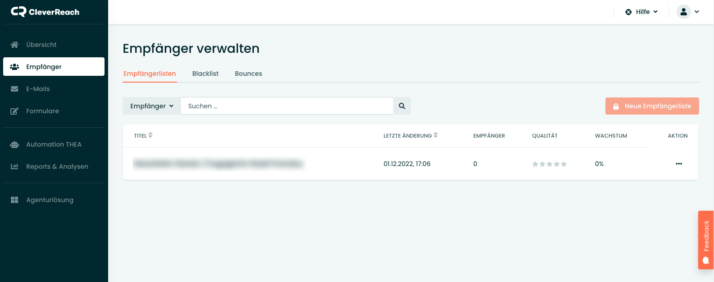
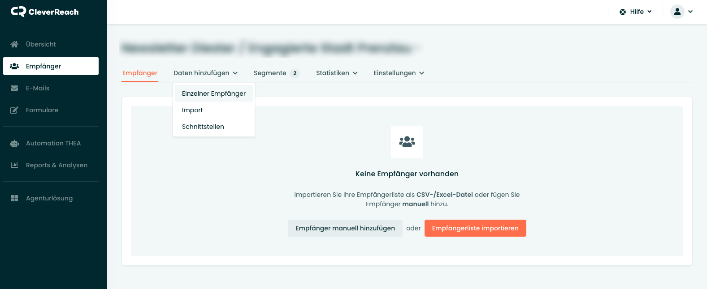
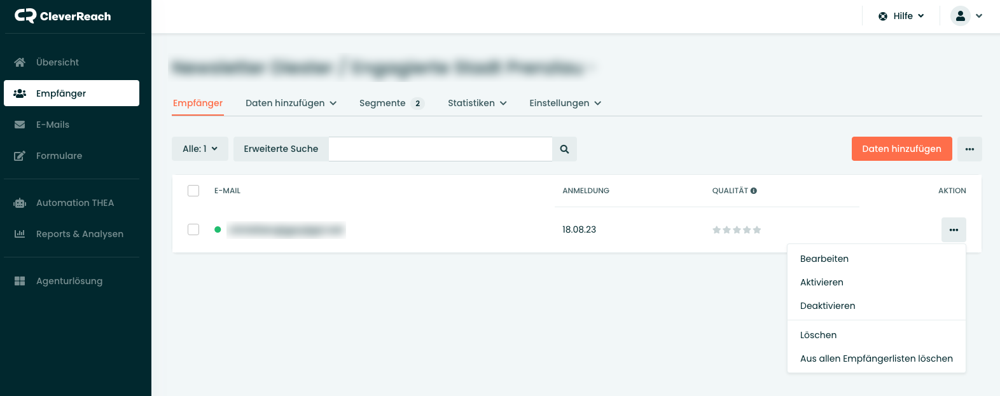

* TOC
{:toc}

## Abonnenten verwalten

Über den Menüpunkt "Empfänger" können alle Newsletter-Abonnenten verwaltet werden. In der Übersicht erscheinen alle Empfängerlisten, die in CleverReach angelegt wurden. Mit einem Klick auf den Listentitel können Empfänger hinzugefügt, bearbeitet oder gelöscht werden.

<strong>Wichtig:</strong> Mit einem kostenlosen Account kann nur <strong>eine</strong> Empfängerlisten angelegt werden.

---

## Manuell hinzufügen

Über den Reiter "Daten hinzufügen" können die Empfänger zur Liste hinzugefügt werden. Dabei können einzelne Adressen von hand eingetragen werden, oder eine komplette CSV-Datei mit einer existierenden Liste importiert werden.

**Einzelne Adressen hinzufügen**

Mit einem Klick auf den Button "Einzelner Empfänger" öffnet sich ein Pop-Up, in dem die Adresse und das zugehörige Segment des Empfängers eingetragen werden müssen.

<strong>Wichtig:</strong> Wenn nur eine Empfängerlisten angelegt werden kann, kann diese Liste segmentiert werden, um verschiedene Newsletter an unterschiedliche Gruppen zu senden.  
Für den Dieser-Newsletter gibt es folgende Segmente:
<ul>
    <li>Moderationspool Prenzlau</li>
    <li>Newsletter Engagierte Stadt Prenzlau</li>
</ul>
<strong>Bitte die Segmente immer beim manuellen Anlegen eines Empfängers eintragen!</strong>

---

## Per Formular hinzufügen

Idealerweise sollten die Empfänger <strong>nicht</strong> manuell hinzugefügt werden, sondern sich über ein Formular selbst eintragen.

Das entsprechende Anmeldeformular ist unter folgender URL zu finden: 
[» seu2.cleverreach.com/f/337654-346018/](https://seu2.cleverreach.com/f/337654-346018/)

---

## Abonnenten bearbeiten

Die einzelnen Abonnenten können in der Übersicht über den Button "Aktion" bearbeitet werden.

