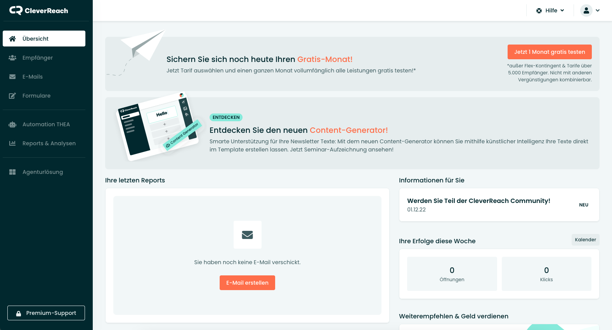

* TOC
{:toc}

## CleverReach Login

Der Login zum CleverReach-Adminbereich findet sich unter folgender URL:

[» eu2.cleverreach.com/admin/login.php](https://eu2.cleverreach.com/admin/login.php)

Zum Login benötigt man die Kundennummer, den Benutzernamen (mit dem Account verknüpfte Mailadresse) und das Passwort.

---

## Das Dashboard

Nach dem Einloggen wird das Dashboard von CleverReach angezeigt. 

Über die Menüleiste links erhält man Zugriff auf die wichtigsten Bereiche:

* Empfänger: [Hier werden die Newsletter-Abonnenten verwaltet]({{ site.baseurl }}/cleverreach/abonnenten-verwalten).
* E-Mails: [Hier werden die jeweiligen Newsletter erstellt]({{ site.baseurl }}/cleverreach/newsletter-erstellen).
* Formulare: Hier werden die An- und Abmeldeformulare für die Empfängerlisten verwaltet.
* Reports & Analysen: Hier können Statistiken der letzten versendeten Newsletter eingesehen werden. [Außerdem gibt es hier die Möglichkeit, einen versendeten Newsletter zu duplizieren und erneut zu versenden]({{ site.baseurl }}/cleverreach/newsletter-erstellen#newsletter-duplizieren).