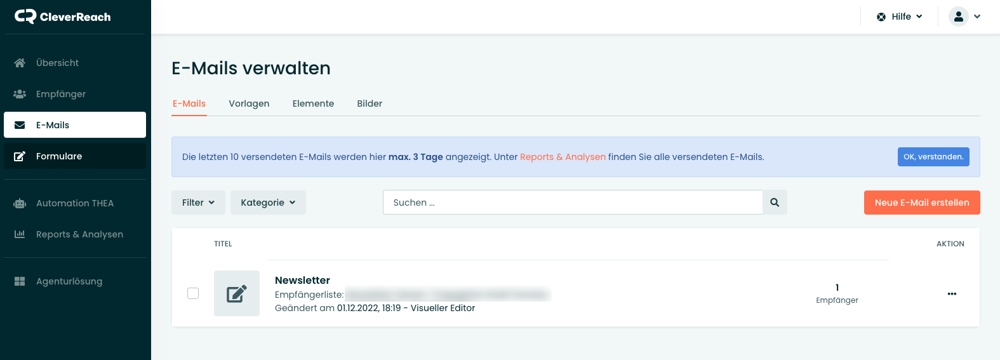
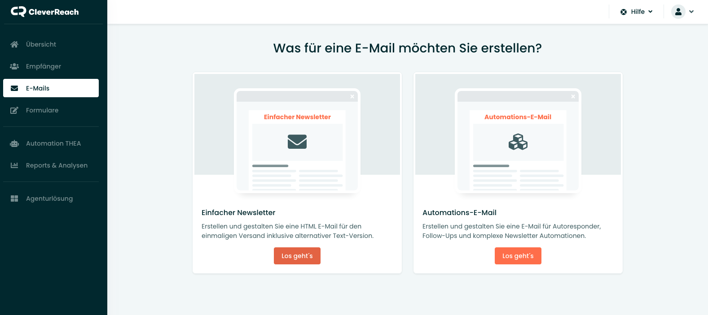
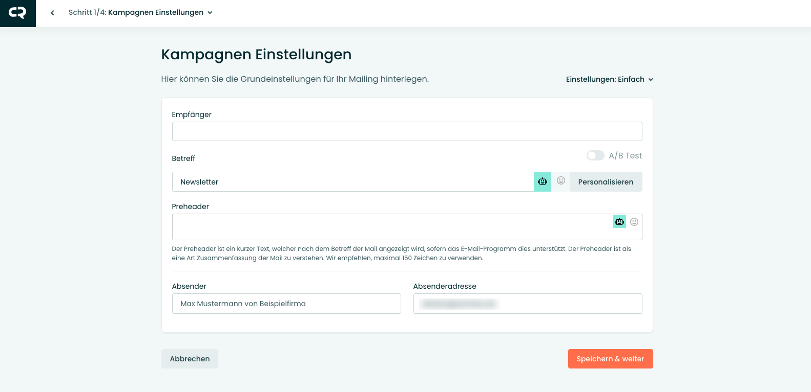
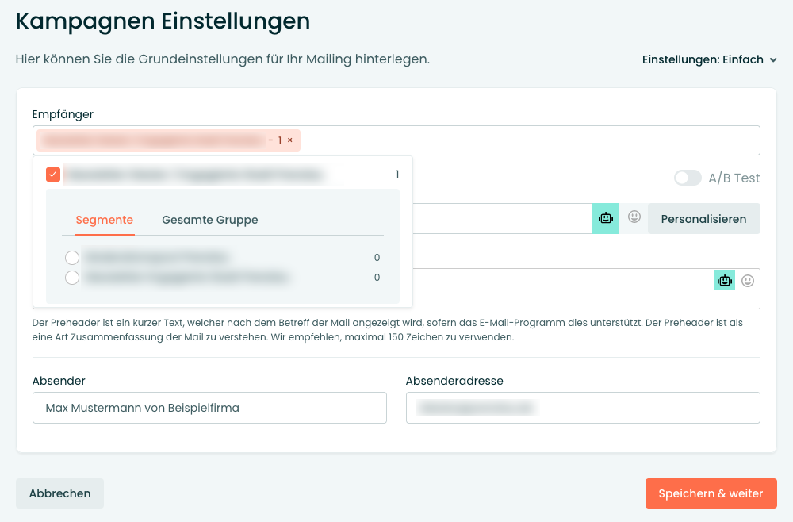
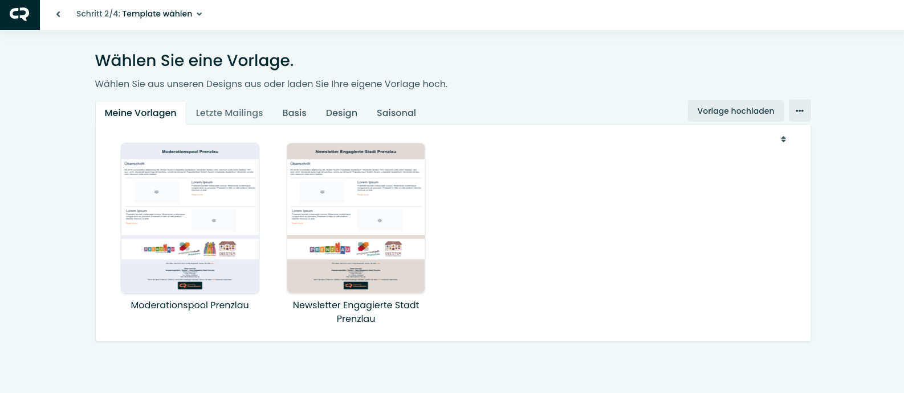
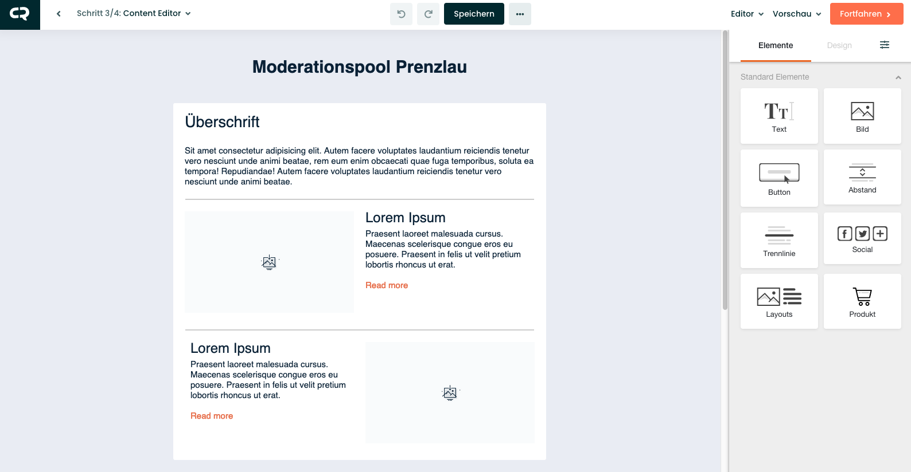
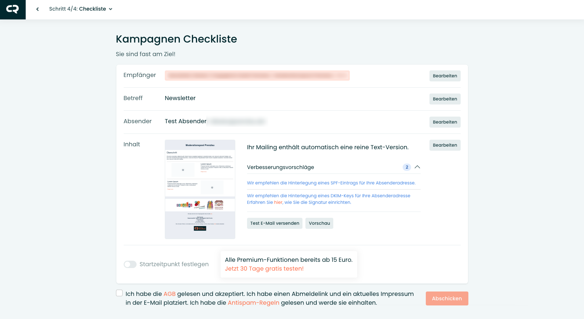
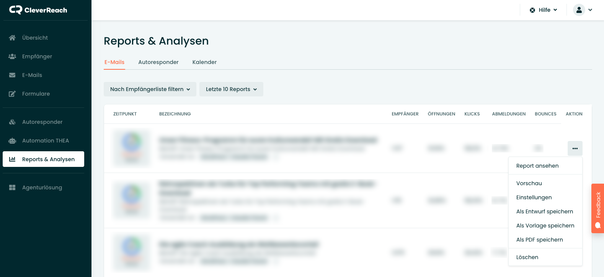

* TOC
{:toc}

## Newsletter erstellen

Die Erstellung eines Newsletters erfolgt unter dem Menüpunkt "E-Mails". Mit einem Klick auf den Button "Neue E-Mail erstellen" wird ein neuer Newsletter zum Versenden angelegt.

Die Übersicht zeigt immer die noch nicht versendeten Newsletter. Versendete Newsletter sind unter dem Menüpunkt "Reports & Analysen" aufgelistet.

Nach dem Klick auf den Button erscheint eine Abfrage über das Format der zu erstellenden E-Mail. Das ist eigentlich immer ein "einfacher Newsletter". Mit einem Klick auf "Los geht's" startet die Erstellung des Newsletters.

---

## Schritt 1: Einstellungen

Im ersten Schritt werden die wichtigsten Daten für die Kampage eingetragen. 
Das wären: 
* die Empfängerliste, an die der Newsletter verschickt werden soll.
* der Betreff des Newsletters.
* ein Preheader, der in der Übersicht des Mailprogramms beim Empfänger angezeigt wird, bevor der Newsletter geöffnet wird.
* der Absendername und die Absenderadresse.

Sollten die Empfängerlisten mit Segmenten arbeiten, ist es wichtig bei der Empfängerliste das entsprechende Segment mit anzugeben, an das der Newsletter versendet werden soll. <strong>Ansonsten wird der Newsletter an die komplette Empfängerliste versendet.</strong>

---

## Schritt 2: Gestaltungsvorlage

Im zweiten Schritt wird die Gestaltungsvorlage für den Newsletter ausgewählt. Unter dem Reiter "Meine Vorlagen" werden die bereits angelegten, individuellen Vorlagen angezeigt.

---

## Schritt 3: Content Editor

Im dritten Schritt erfolgt die Bearbeitung des Inhalts. Die einzelnen Element können befüllt oder auch gelöscht werden.
Über die Elemente in der Seitenspalte können neue Inhalte per Drag-und-Drop eingefügt werden.

---

## Schritt 4: Checkliste

Im letzten Schritt wird der Newsletter noch einmal überprüft. In der kostenlosen Version kann der Newsletter nur direkt versendet werden. Einen individuellen Startzeitpunkt für den Versand festzulegen ist erst ab der Premium-Version möglich.

---

## Newsletter duplizieren

Unter dem Menüpunkt "Reports & Analysen" können bereits versendete Newsletter dupliziert und somit erneut als Entwurf gespeichert werden.
Über den Button "Aktion" muss nur der Punkt "Als Entwurf speichern" ausgewählt werden.

