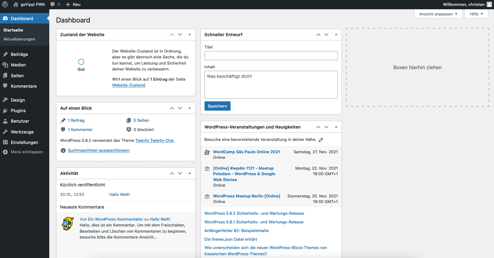
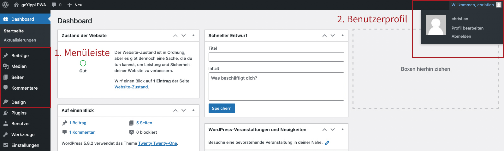
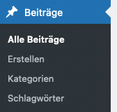
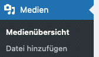
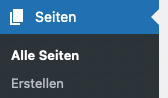
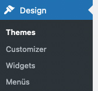
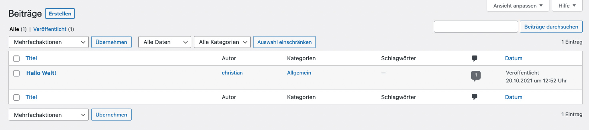
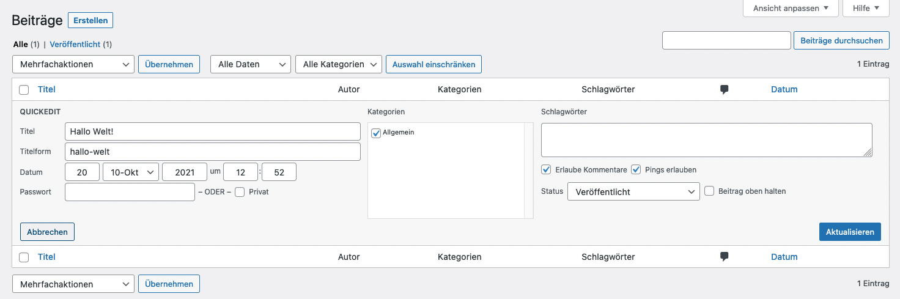
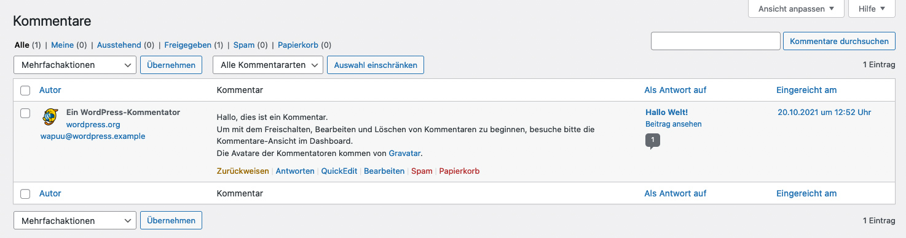

* TOC
{:toc}

## Erste Schritte

Der Adminbereich kann bei einer normalen WordPress-Installation über folgende Links erreicht werden:

* https://deine-domain.de/wp-admin
* https://deine-domain.de/wp-login.php
* https://deine-domain.de/login
* https://deine-domain.de/admin

Die Zugangsdaten hast Du entweder selbst beim Installieren von WordPress festgelegt, oder sie werden Dir von Deinem Webdesigner zur Verfügung gestellt.

---

## Das Dashboard

Nach dem Einloggen siehst Du das Dashboard Deiner WordPress-Installation. Hier bekommst Du einen schnellen Überblick über die Anzahl der veröffentlichten Beiträge/Seiten, sowie einen Schnellzugriff auf Beiträge, die noch im Entwurfsstadium sind.

Die beiden wichtigsten Elemente sind die Menüliste links, sowie der Zugang zu Eurem Benutzer-Profil oben rechts.

**1. Menüleiste**

Hier erhältst Du Zugang zu den einzelnen Inhaltstypen auf der Webseite:

* Beiträge: Eure gesammelten Blogbeiträge sowie die Verwaltung der Kategorien und Schlagworte.
* Medien: Hochgeladene Bilder, PDFs, MP3s etc.
* Seiten: Eure statischen Seiten (z.B. Über mich, Kontakt, Datenschutzerklärung, Impressum)
* Kommentare: Die Verwaltung der Kommentare zu Euren Blogbeiträgen
* Design: Die Verwaltung von Menüs und Widgets

Die weiteren Menüpunkte sind je nach Berechtigung des Accounts teilweise nicht sichtbar.

<strong>Wichtig:</strong> Bei den weiteren Punkten sollten nur Änderungen vorgenommen werden, wenn Du ein entsprechendes Wissen über WordPress, PHP und Datenbanken mitbringst. Änderungen an der falschen Stelle können hier zu Fehlern oder auch zur Nichterreichbarkeit der Webseite führen.

**2. Benutzerprofil**

Hier kannst Du Dein eigenes Nutzerprofil bearbeiten (z.B. Mailadresse oder Passwort ändern) oder **Dich nach Beendigung der Arbeiten an der Webseite ausloggen**.

---

## Die einzelnen Inhaltstypen

**1. Beiträge**

{:.alignright}
Unter Beiträgen werden in einer WordPress-Installation Inhalte verstanden, die nach Aktualität auf der Webseite abgebildet werden und außerdem über Kategorien und Schlagworte zusammengefasst werden können. Also eigentlich die klassische Blog-Funktion. Auf der Webseite erhältst Du dann eine Liste von Beiträgen, sortiert nach dem Veröffentlichungsdatum. Diese Funktion eignet sich z.B. auch zum Abbilden eines News-Bereichs.

Zusätzlich zu Kategorien und Schlagworten können Beiträge auch kommentiert werden, wenn es in den Einstellungen der Installation festgelegt ist.

Mit einem Klick im Adminbereich auf den Punkt "Beiträge" erscheint ebenso eine Liste der erstellten Beiträge. Außerdem kannst Du hier die Kategorien und Schlagworte verwalten.

**2. Medien**

{:.alignright}
Unter Medien findest Du alle Dateien, die in Deiner WordPress-Installation hochgeladen wurden.

Das können Bilder sein (.jpg, .png, .gif), wie auch andere Dateiformate (.pdf, .doc, .docx), oder auch Videos oder Audiodateien (.mp3, .m4v, .mp4v).

[» Mehr Informationen zur Mediathek]({{ site.baseurl }}/wordpress/mediathek)

**3. Seiten**

{:.alignright}
Unter Seiten werden in einer WordPress-Installation Inhalte verstanden, die nicht nach Datum abgebildet werden müssen oder einer Taxonomie (Kategorie oder Schlagwort) zugeordnet werden sollen. Seiten sind also statische Inhalte, wie z.B. eine Über mich-Seite, eine Kontaktseite oder das Impressum der Webseite. Dementsprechend gibt es in diesem Untermenü auch keine Verwaltung von Kategorien oder Schlagworten.

**4. Kommentare**

An dieser Stelle kannst Du die Kommentare zu Deinen Beiträgen verwalten. Teilweise müssen Kommentare freigegeben werden, oder Du musst Kommentare als Spam markieren.

Spam-Kommentare sollte grundsätzlich nicht gelöscht werden, sondern als "Spam" markiert werden. So können zukünftige Spam-Kommentare gleich als Spam erkannt werden. Genauso wie es auch in Eurem E-Mail-Postfach passiert.

**5. Design**

{:.alignright}
Hier sind die Unterpunkte "Menüs" und "Widgets" für die Bearbeitung wichtig.

Unter Menüs kannst Du die unterschiedlichen Menüs Deiner Webseite verwalten, Menüpunkte löschen und hinzufügen.

Unter Widgets kannst Du die Widget-Seitenspalte auf den Blog-/News-Seiten editieren. Widgets sind kleine Funktionsblöcke, wie z.B. eine Liste der aktuellsten Beiträge oder der neusten Kommentare.

---

## Die Übersichtsseiten

**1. Beiträge/Seiten**

Die Übersichtsseiten für Beiträge oder Seiten sind eigentlich identisch aufgebaut. Die Seiten stellen eine Liste der Beiträge oder Seiten dar. Bewegst Du die Maus über einen Beitragstitel, erscheint eine Auswahl an Bearbeitungsmöglichkeiten.

Du kannst den Beitrag entweder

1. bearbeiten
2. im Quickeditmodus bearbeiten
3. in den Papierkorb legen
4. anschauen

**Bearbeiten** 
Bei einem Klick auf "Bearbeiten" kommst Du auf den einzelnen Beitrag. Die FUnktionalität werden im nächsten Kapitel "Beiträge/Seiten bearbeiten" erklärt.

**Quickedit** 
Im Quickeditmodus kannst Du einige schnelle Änderungen an dem Beitrag vornehmen. Z.B. das Veröffentlichungsdatum oder den Titel ändern, sowie die Kategorie- und Schlagwortzuweisung ändern. Außerdem kannst Du den Beitrag wieder in den Entwurfstatus zurücksetzen, wenn Du Ihn nicht mehr veröffentlicht haben möchtest

**Papierkorb** 
Hier kannst Du Beiträge in den Papierkorb legen. Die Beiträge sind dann noch nicht gelöscht und können jeder Zeit wieder hergestellt werden.
Erst wenn Du die Beiträge im Papierkorb **unwiderruflich löschst**, sind die Beiträge nicht mehr vorhanden.

**Anschauen** 
Mit einem Klick auf "Anschauen" wirst Du aus dem Adminbereich auf die normale Webseitenansicht geleitet und kannst die aktuelle Version des Beitrags anschauen.

<strong>Wichtig:</strong> Bei der Seitenübersicht fehlen einige Eingabefelder im Vergleich zu den Beiträgen. Das liegt daran, dass die Seiten nicht über Kommentare, Kategorien oder Schlagworte verfügen.

**2. Medien**

Hier siehst Du alle verfügbaren Medien, entweder als Liste oder in einer kompakten Kachelansicht. Mit einem Klick auf das jeweilige Medium kannst Du Bildtitel, Alternativtext, Bildbeschriftung und Bildbeschreibung ändern. Außerdem wird Dir hier die komplette Datei-URL angezeigt.

**3. Kommentare**

Die Übersichtsseiten für Kommentare ähnelt vom Aufbau der Beitrags- und Seitenübersicht. Auch hier werden mit der Mausbewegung über den Kommentar die einzelnen Bearbeitungsmöglichkeiten sichtbar.

Du kannst den Kommentar entweder

1. freigeben oder zurückweisen
2. beantworten
3. im Quickeditmodus bearbeiten
4. bearbeiten
5. als Spam markieren
6. in den Papierkorb legen

Wie schon oben erwähnt: Spam-Kommentare sollte grundsätzlich nicht gelöscht werden, sondern als "Spam" markiert werden. So können zukünftige Spam-Kommentare gleich als Spam erkannt werden.
