* TOC
{:toc}

## Editor

Seit WordPress 5.0 wurde der alte TinyMCE-Editor (Classic Editor) durch den Block-Editor ersetzt. Dadurch hat sich die Arbeit mit Inhalten grundlegend geändert. Während der klassische Editor im Grunde genommen nur ein Textfeld darstellt, in dem Inhalte ausgezeichnet werden können, kannst Du im Block-Editor weitgreifendere Layout-Entscheidungen treffen und in einer Umgebung arbeiten, die mit der Darstellung auf der Webseite identisch ist.

Sollte Deine Webseite noch den klassischen Editor anzeigen, so geschieht das durch das Plugin "Classic Editor". Der klassische Editor wird noch bis Ende 2023 von WordPress unterstützt.

**Classic Editor**

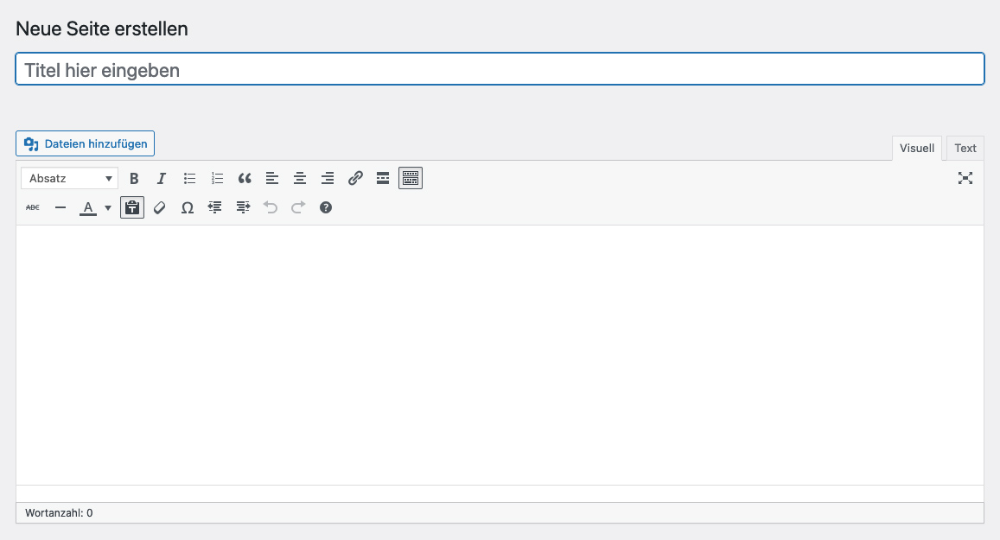

Der klassische Editor ähnelt sehr der gewohnten Oberflächen gängiger Textbearbeitungsprogramme wie Word oder Open Office. Die Bearbeitung findet in dem Editorfeld statt. Dem markierten Text können Auszeichungen oder Verlinkungen hinzugefügt werden. Über den Button "Dateien hinzufügen" können Bilder und Dateien eingebunden werden. Mehr dazu im Abschnitt "Medien einbinden".

**Block Editor**

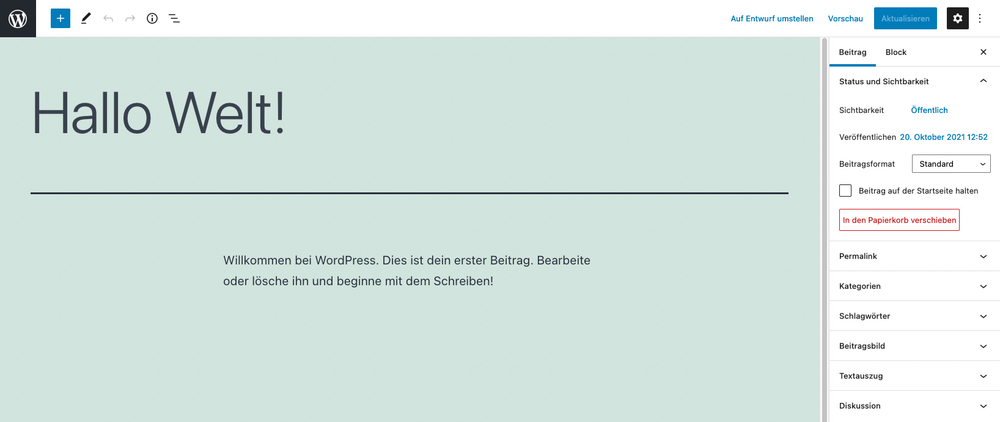

Der Block-Editor erscheint beim ersten Öffnen sehr reduziert und im Vollbildmodus. Das kann verwirrend sein, daher empfiehlt es sich, den Vollbildmodus erstmal auszuschalten.

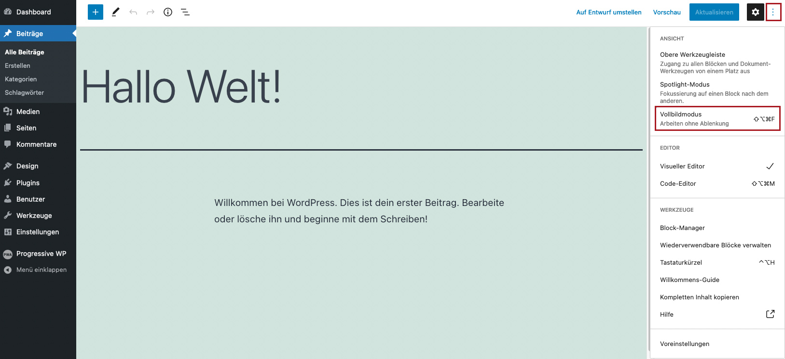

Das ist möglich über das Einstellungsmenü oben rechts (drei senkrechten Punkte) und die Deaktivierung der Auswahl bei "Vollbildmodus". Damit wird die linke Menüspalte wieder dargestellt.

**Block Editor – Elemente**

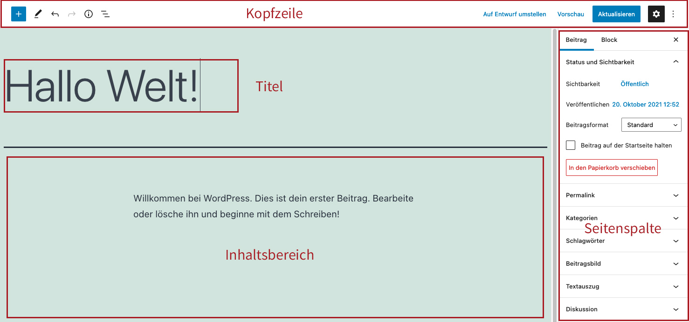

Der Screen des Block-Editors gliedert sich in vier Funktionsgruppen

1. **Kopfzeile**
    * Über das Plus-Symbol können neue Blöcke in den Inhaltsbereich eingefügt werden.
    * Über das Stiftsymbol kann zwischen Bearbeitungsmodus und Auswahlmodus gewechselt werden.
    * Über die Pfeil können Bearbeitungsschritte rückgängig oder wiederhergestellt werden.
    * Über das Info-Icon gibt es Informationen zu Wortanzahl etc. auf dem Beitrag.
    * Über das Struktursymbol kann die Blockstruktur des Beitrags betrachtet werden.
    * Auf der rechten Seite kann der Beitrag zurück auf Entwurf gestellt werden, aktualisiert werden oder die Einstellungen können geändert werden.
2. **Titelfeld** Hier wird der Titel des Beitrags / der Seite eingegeben.  
3. **Inhaltsfeld** Hier wird der Inhalt editiert und mit Blöcken aufgebaut.  
4. **Seitenspalte**  Hier können unter dem Reiter "Beitrag" bzw. "Seite" beitrags- oder seitenweite Einstellungen getätigt werden. Unter dem Reiter "Block" können Einstellungen zu dem jeweils ausgewählten Block getätigt werden.

[» Detailierte Erläuterung des Block-Editors](https://gutenberg-fibel.de/editor/)

---

## Inhalte bearbeiten

Die Inhalte beim Block-Editor befinden sind in dem Inhaltsfeld. Wichtig für das Verständnis der Arbeitsweise des Editors ist, dass jeder Absatz und jedes Element im Editor ein eigener "Block" ist.  

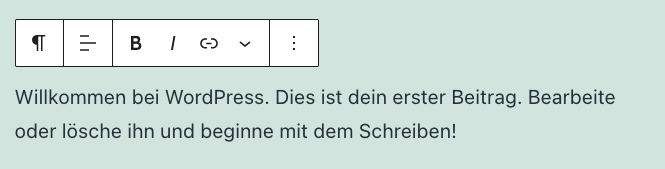

Wenn Du einen Block anwählst, erscheint am Beginn des Blocks ein Bearbeitsmenü, das Dir Möglichkeuten zur Formatierung des Blocks zeigt. Wenn Du in der Kopfzeile den Auswahlmodus einstellst, kannst Du genauer sehen, wie das Layout aus den einzelnen Blöcken aufgebaut ist.

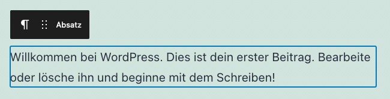

Du kannst Blöcke untereinander verschieben oder auch mehrere Blöcke gemeinsam auswählen und verschieben. Die Arbeits muss als nicht unbedingt pro Block erledigt werden. Du kannst auch ganzen Layout-Gruppen von A nach B verschieben.

Wenn Du einen neuen Block hinzufügen möchtest, kann das über mehrere Wege passieren:

1. Du wählst das Plus-Symbol in der Kopfzeile aus
2. Du bewegst die Maus zwischen zwei Blöcke und wählst das Plus-Symbol aus
3. Du fügst einen neuen Absatz (Return) ein. Dann erscheint auch das Plus-Symbol zur Blockauswahl

Es gibt eine Vielzahl von Blöcken:

* Textelemente: Absatz, Liste, Überschrift, Zitat, etc.
* Medienelemente: Bild, Galerie, Audio, Video, Datei, etc.
* Designelemente: Buttons, Spalten, Gruppen, Trennzeichen, Abstandhalter, etc.
* Widgets: Neueste Kommentare, Neueste Beiträge, etc.
* Einbettungen: Youtube, Twitter, Instagram, etc.

[» Detailierte Liste an Blöcken](https://gutenberg-fibel.de/bloecke/)

Jeder Block besitzt eigene Formatierungsmöglichkeiten. Bitte nutzt den Link "Detailierte Liste an Blöcken", um Euch über die einzelnen Blöcke zu informieren. Beispielhaft wird im folgenden der Bild-Block erläutet, da er (abseits von Absätzen und Überschriften) sicherlich am häufigsten verwendet wird.

---

## Medien einbinden

Wie oben erwähnt, werden Medien über Blöcke eingebunden. So kannst Du z.B. einen Bild-Block auswählen. Dann erhältst Du eine Auswahl an Möglichkeiten, das Bild einzubinden:

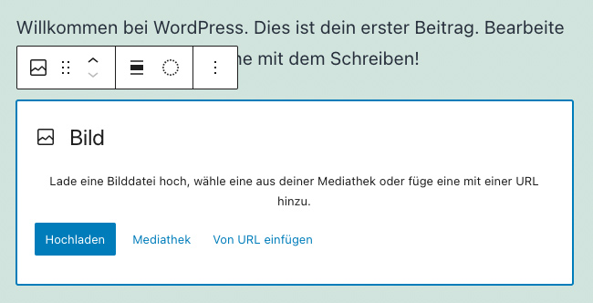

1. Das Bild direkt von Deinem Rechner hochladen
2. Das Bild aus der Mediathek auswählen, wenn es schon vorher hochgeladen wurde
3. Das Bild mit der URL direkt einzubinden

<strong>Wichtig:</strong> Die dritte Möglichkeit ist eigentlich nicht praktikabel. Sollte der Pfad des Bildes auf der Ursprungsseite geändert oder das Bild gelöscht werden, kann das Bild nicht mehr angezeigt werden. Daher macht es Sinn, Möglichkeit 1 oder 2 zu nutzen.

Alle hochgeladenen Medien laden in der Mediathek. Es ist also sinnvoll, vor dem Hochladen zu überlegen oder nachzuschauen, ob das Bild nicht eventuell schon in der Mediathek vorhanden ist.

**1. Das Bild direkt von Deinem Rechner hochladen**

Hier wird ein Dialog zu Deinem Rechner geöffnet, in dem Du das gewünschte Bild auf Deinem Rechner auswählen und hochladen kannst. Das Bild wird dann in den Bild-Block geladen und dargestellt.

**2. Das Bild aus der Mediathek auswählen**

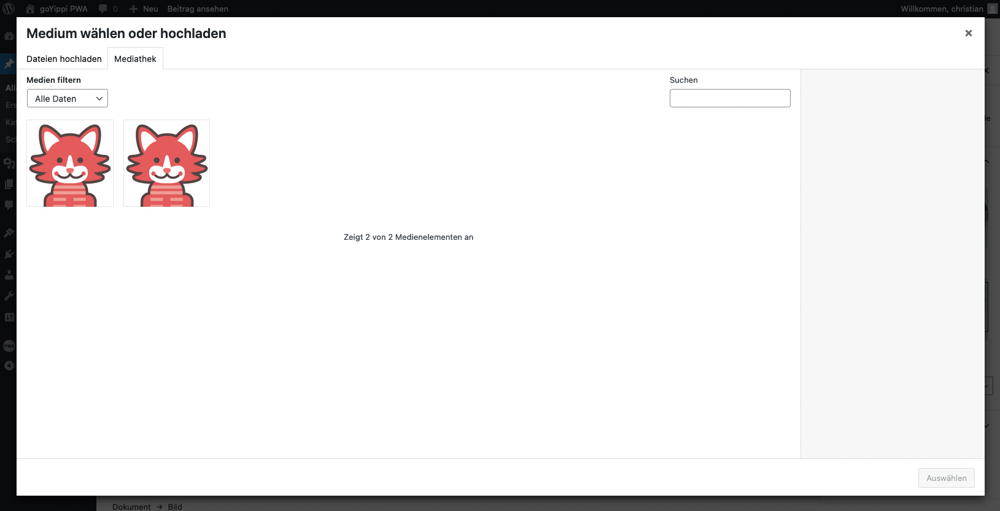

Hier wird ein Dialog zur Mediathek geöffnet. Du kannst das Bild aus den vorhandenen Bildern in der Mediathek auswählen. Sollte das Bild doch nicht in der Mediathek vorhanden sein, kannst Du es über den Reiter "Hochladen" auch direkt von Deinem Rechner hochladen.

<strong>Wichtig:</strong> Beim "Classic Editor" geschieht das Einfügen der Medien über den Button "Dateien hinzufügen" über dem Editorfenster. Ein Klick auf den Button rufen den Mediathek-Dialog auf, der identisch mit dem Dialog im vorherigen Absatz ist.

---

## Speichern & Veröffentlichen

WordPress hat zum Speichern und Veröffentlichen einen sehr einfachen Workflow:

* Solange ein Beitrag noch nicht veröffentlicht wurde, befindet er sich im Entwurfsstadium und kann beliebig oft geändert und gespeichert werden, ohne dass der Beitrag für den Benutzer sichtbar ist.
* Wird der Beitrag veröffentlicht, gibt es keine Möglichkeit mehr, Änderungen zu terminieren oder Zwischenstände zu speichern. Wird der veröffentlichte Beitrag aktualisiert, so sind die Änderungen direkt für den Besucher sichtbar.

In der Kopfzeile kann der Beitrag gespeichert oder veröffentlicht werden:

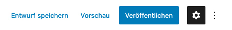

Wurde der Beitrag veröffentlicht, ändert sich auch die Kopfzeile zu folgender Ansicht:

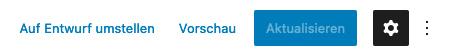

Mit dem ersten Button kann der veröffentlichte Beitrag wieder in den Entwurfsstatus zurückgesetzt werden. Damit wird er für die Besucher nicht sichtbar. Mit dem Button "Aktualisieren" können die getätigten Änderungen veröffentlicht werden.

---

## Löschen

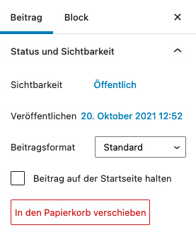{:.alignright}
Ein Beitrag oder eine Seite kann direkt auf der jeweiligen Bearbeitungsansicht gelöscht werden. Dazu gibt es in der Seitenspalte unter dem Reiter "Beitrag" bzw. "Seite" den roten Button "In den Papierkorb verschieben". Damit wird der Beitrag in der Papierkorb gelegt und kann nicht mehr von den Besuchern aufgerufen werden. Beiträge oder Seiten im Papierkorb können dann entweder wiederhergestellt oder unwiderruflich gelöscht werden.

Das Löschen kann auch auf der Übersichtsseite geschehen, wenn Du mit der Maus über den einzelnen Titel gehst und den Link "Papierkorb" auswählst.

---

## Kategorien, Tags & Beitragsbild

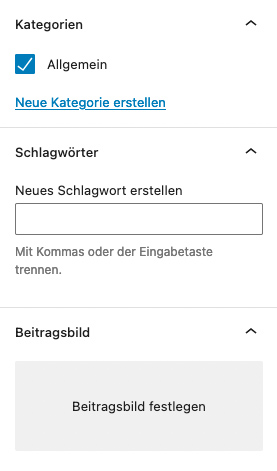{:.alignright}
Bei Beiträgen gibt es in der Seitenspalte die Möglichkeit Kategorien und Schlagworte zuzuwiesen. Es können an der Stelle sowohl vorhandene Kategorien/Schlagworte verwendet werden, wie auch neue Kategorien/Schlagworte angelegt werden.

Die Verwaltung der Kategorien sowie Schlagworte geschieht über den Link im Submenü unter "Beiträge".

Außerdem gibt es die Möglichkeit ein Beitragsbild festzulegen. Je nach verwendetem Theme wird das Beitragsbild bei der Blogübersicht oder bei Kategoriearchiven dem Besucher angezeigt. Auch die Beitragsbilder werden in der Mediathek gespeichert und sich dort mit allen anderen hochgelandenen Medien gesammelt.

Das Beitragsbild kann abhängig vom Theme eventuell **auch bei Seiten** festgelegt werden.

---

## Seiten-Attribute

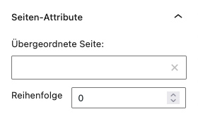{:.alignright}
Bei Seiten gibt es die Möglichkeit in der Seitespalte Seitensttribute festzulegen. Zum einen kann festgelegt werden, ob die Seite eine Unterseite einer anderen Seiten seien soll, Das geschieht über die Auswahl "Übergeordnete Seite".

Zum andere kann festgelegt werden, in welcher Reihenfolge die Seiten auf der Seitenübersicht erscheinen. Dazu wird in das Feld "Reihenfolge" eine Ziffer eingegeben. Je kleiner die Zahl, desto weiter oben wird die Seite gelistet.

<strong>Wichtig:</strong> Die Angabe der Reihenfolge hat keine Auswirkung auf die Darstellung im Menü. Ebenso hat die Veröffentlichung einer Seite keine Auswirkung auf die Menü-Darstellung. Mehr zu diesem Theme unter dem Punkt "<a href="/wordpress/menu-bearbeiten">Menü bearbeiten</a>".

