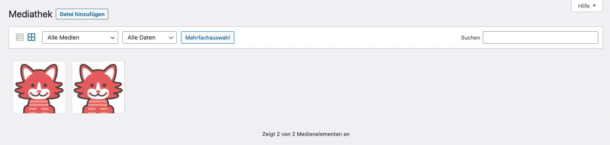

* TOC
{:toc}

## Mediathek

Unter Medien findest Du alle Dateien, die in Deiner WordPress-Installation hochgeladen wurden.

Das können Bilder sein (.jpg, .png, .gif), wie auch andere Dateiformate (.pdf, .doc, .docx), oder auch Videos oder Audiodateien (.mp3, .m4v, .mp4v).

Die Mediathek kann in einer Kachelansicht oder in der gewohnten Listenansicht dargestellt werden.

Über den Button "Datei hinzufügen" kannst Du Dateien von Deinem Rechner hinzufügen.

Über die Mehrfachaktionen oder die Mehrfachauswahl können mehrere Dateien zugleich gelöscht werden.

<strong>Wichtig:</strong> Das Löschen der Dateien ist immer sofort unwiderruflich. Im Gegensatz zu den Beiträgen oder Seiten gibt es in der Mediathek <strong>keinen Papierkorb</strong>. Die Dateien werden also sofort gelöscht.

---

## Einzelne Datei bearbeiten

**Kachelansicht**

Mit einem Klick auf die einzelne Datei kannst Du Bildtitel, Alternativtext, Bildbeschriftung und Bildbeschreibung ändern. Außerdem wird Dir hier die komplette Datei-URL angezeigt.

**Listenansicht**

Mit einem Klick auf "Bearbeiten" in der Listenansicht kommst Du ebenfalls in den Barbeitungsmodus der hochgeladenen Datei. Die Bearbeitungsmöglichkeiten sind identisch mit der Kachelansicht.

