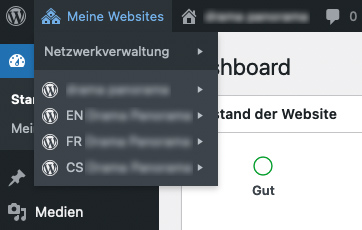
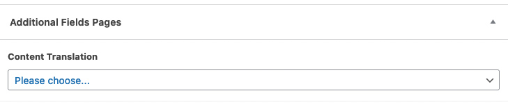

* TOC
{:toc}

## Mehrsprachigkeit

WordPress bietet von sich aus keine Mehrsprachigkeit an. Aber dennoch läßt sich diese Funktion mit WordPress realisieren.

Wir nutzen dazu grundsätzlich die WordPress-eigene Multisite-Funktion und **nicht** die angebotenen Mehrsprachigkeits-Plugins.

[» Mehr Informationen zu Multisites](https://wordpress.org/support/article/create-a-network/)

Durch die Multisite können mehrere WordPress-Seiten in einer WordPress-Installation verwaltet werden.

{:.alignright}
Für die Mehrsprachigkeit wird also pro gewünschter Sprache eine WordPress-Seite in der entsprechenden Sprache in der Installation angelegt.

Der Zugang zu den einzelnen Übersetzungen funktioniert dann über das Menü "Meine Websites" links oben in der Kopfzeile des Adminbereichs.

Sollte dieses Menü bei Deiner WordPress-Installation fehlen, wurde keine Multisite eingerichtet.

---

## Übersetzungen verknüpfen

Über Zusatzfelder können die Übersetzungen auch untereinander verknüpft werden, so dass der Klick auf das Sprachmenü auch auf die entsprechende Seite in der ausgewählten Sprache führt.

Das Zusatzfeld befindet sich je nach Theme entweder unter dem Editor am Ende der Seite oder in der rechten Seitenspalte.
