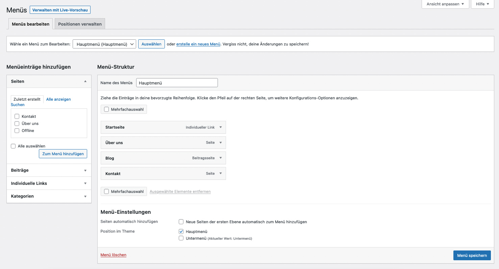
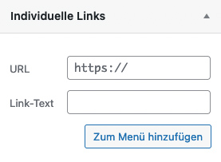
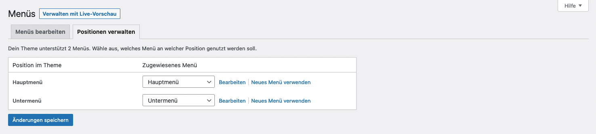

* TOC
{:toc}

## Menüs

In WordPress werden die Menüs mit einem eigenen Tool verwaltet. Das bedeutet, dass Seiten oder Beiträge, die veröffentlich wurden, **nie automatisch in einem Menü erscheinen**. Die gewünschten Änderungen im Menü müssen in der Menü-Verwaltung festgelegt werden.

Die Menü-Verwaltung findest Du unter "Design > Menüs". Je nach Theme und Benutzerrolle kann es sein, dass Du keinen Zugriff auf diesen Menüpunkt hast.

Die Menü-Verwaltung besitzt zwei Reiter: "Menüs bearbeiten" und "Positionen verwalten"

---

## Menüs bearbeiten

Unterhalb des Reiters am Beginn der Seite kannst Du das gewünschte Menü auswählen oder ein neuen Menü anlegen.

In der linken Seitenspalte werden alle Inhaltselemente aufgelistet, die dem Menü hinzugefügt werden können:

* Seiten
* Beiträge
* Individuelle Links
* Kategorien

Je nach Theme und installierten Plugins können hier auch noch mehr Elemente auftauchen.

Die einzelnen Elemente können einfach ausgewählt werden und über den Button "Zum Menü hinzufügen" zum Menü auf der rechten Seiten hinzugefügt werden.

Dort können die Elemente mit der Maus angefasst und per Drag & Drop an die gewünschte Stelle geschoben werden.

{:.alignright}
Wenn ein Menü-Eintrag hinzugefügt werden soll, der nicht den Seiten oder Beiträgen entspricht, kannst Du einen individuellen Link eingeben. Das Feld "URL" beinhaltet die Adresse der gewünschten Verlinkung. Das Feld "Link-Text" ist die Benennung des Menüpunkts.

Auch hier kann das hinzugefügt Elemente mit der Maus angefasst und per Drag & Drop an die gewünschte Stelle geschoben werden.

Unter "Menü-Einstellungen" kannst Du festlegen, an welcher Position im Theme das Menü erscheinen soll. Das ist die gleiche Funktion, die auch der Reiter "Positionen verwalten" bietet.

<strong>Wichtig:</strong> Die Änderungen in den Menüs müssen ebenfalls gespeichert werden. Das passiert mit dem blauen Button "Menü speichern".

---

## Positionen verwalten

Hier kannst Du verwalten, welches Menü an welcher Position im Theme erscheinen soll. Eine ähnliche Funktion gibt es auch unter jedem Menü bei "Menü bearbeiten".

Allerdings hast Du hier einen Überblick über alle Positionen gleichzeitig und kannst auch zu allen Menüs in den Bearbeitungsmodus wechseln.
