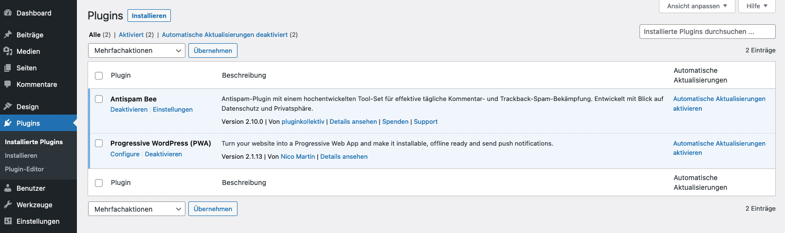

## Plugins

WordPress läßt sich über eine Vielzahl von Plugins in seiner Funktionalität erweitern. Von Terminkalendern bis zu Backup-Lösungen läßt sich im Pluginverzeichnis von WordPress für fast jedes Problem eine Lösung finden.

[» WordPress Pluginverzeichnis](https://wordpress.org/plugins/)

Je nach Theme und Benutzerrolle kann es sein, dass Du keinen Zugriff auf diesen Menüpunkt hast.

<strong>Wichtig:</strong> Du solltest nur Plugins installieren und deinstallieren, wenn Du ein entsprechendes Wissen über WordPress, PHP und Datenbanken mitbringst. Nicht jedes Plugin ist sauber programmiert und die Installation kann zu Fehlermeldungen auf der Webseite führen! Ebenso kann eine Deinstallation eines Plugins dazu führen, dass die Webseiten ebenfalls nicht mehr richtig funktioniert oder Fehler ausgibt!

