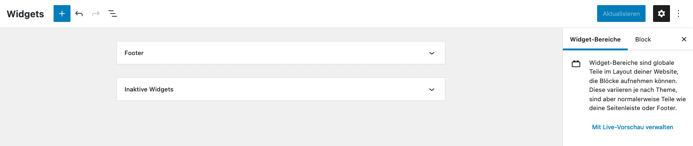
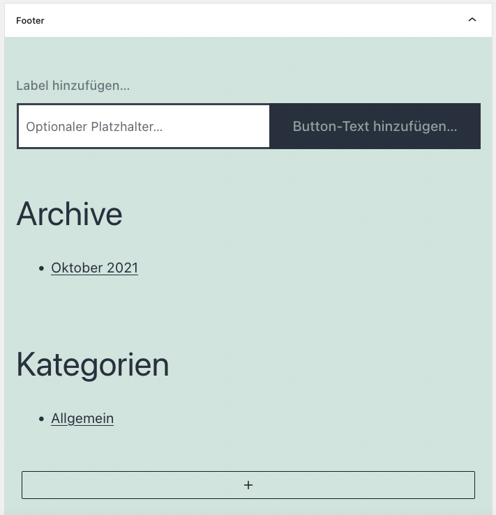

* TOC
{:toc}

## Widgets

Unter Widgets versteht man Funktionselemente, die in der Seitenspalte der Blogübersicht oder im Seiten-Footer erscheinen. Der Vorteil der Elemente ist, dass sie auf mehreren Seiten erscheinen können und nur an einer Stelle verwaltet werden müssen. Änderungen müssen also nicht auf jeder Seite getätigt werden, sondern nur einmalig in der Widget-Verwaltung.

Die Widget-Verwaltung findest Du unter "Design > Widgets". Je nach Theme und Benutzerrolle kann es sein, dass Du keinen Zugriff auf diesen Menüpunkt hast.

<strong>Wichtig:</strong> Seit WordPress 5.8 werden auch die Widgets in Blöcken aufgebaut. Bei WordPress-Installationen, die das Plugin "Classic Widgets" installiert haben, sieht die Widget-Verwaltung entsprechend anders aus.

---

## Widget Editor

Der Widget-Editor ist analog zum Beitrag- bzw. Seiteneditor aufgebaut.

1. **Kopfzeile**
    * Über das Plus-Symbol können neue Blöcke in den Inhaltsbereich eingefügt werden.
    * Über die Pfeil können Bearbeitungsschritte rückgängig oder wiederhergestellt werden.
    * Über das Struktursymbol kann die Blockstruktur der Widgets betrachtet werden.
    * Auf der rechten Seite können die Widgets aktualisiert werden.
2. **Inhaltsfeld** Hier werden die Widgets editiert und mit Blöcken aufgebaut.  
3. **Seitenspalte** Unter dem Reiter "Block" können Einstellungen zu dem jeweils ausgewählten Block getätigt werden.

Im Inhaltsbereich kann der entsprechende Widgetbereich ausgewählt und bearbeitet werden (z.B. Footer). Die Bearbeitung der Blöcke funktioniert analog zu der Bearbeitung der Beiträge oder Seiten.

