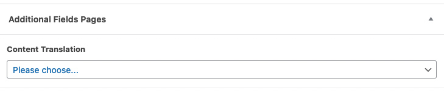
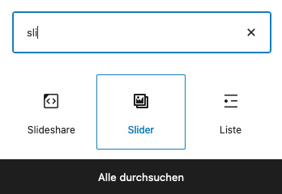
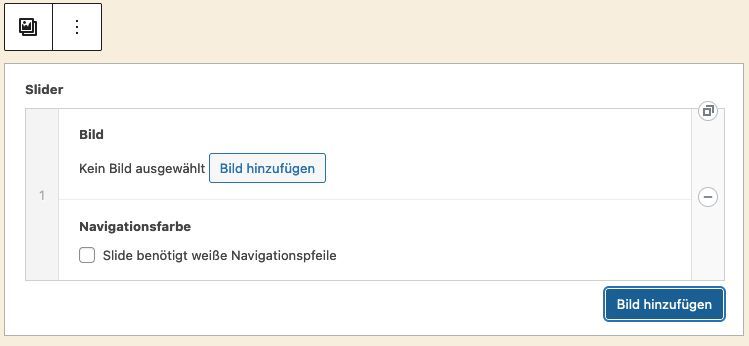

* TOC
{:toc}

## Zusatzfelder durch Advanced Custom Fields

Wie schon im Abschnitt "Mehrsprachigkeit" erwähnt, werden bestimmte Einstellungen auf Artikeln oder Seiten über Zusatzfelder getätigt. Um die Zusatzfelder (Custom Fields) benutzerfreundlich darzustellen, verwenden wir das Plugin "Advanced Custom Fields", kurz ACF.

[» Mehr Informationen zu Advanced Custom Fields](https://www.advancedcustomfields.com/)

Das Zusatzfeld befindet sich je nach Theme entweder unter dem Editor am Ende der Seite oder in der rechten Seitenspalte.

Je nach Theme und Einstellungsmöglichkeiten unterscheidet sich auch die Anzahl oder die Benennung der Zusatzfelder.

---

## Individuelle Blöcke durch Advanced Custom Fields

{:.alignright}
Das Plugin "Advanced Custom Fields" kann auch verwendet werden, um individuelle Blöcke für den Block-Editor zu erstellen.

So kann z.B. ein Slider in den Block-Editor integriert werden, ohne das weitere Plugins nötig sind.

Der individuelle Block kann ganz gewöhlich über die Block-Auswahl aufgerufen werden und auf die Seite integriert werden.

Der individuelle Block erscheint dann im Inhaltsbereich und kann befüllt werden.

Wie bei den Zusatzfeldern gibt es je nach Theme unterschiedliche individuelle Blöcke, eventuell auch keine.
